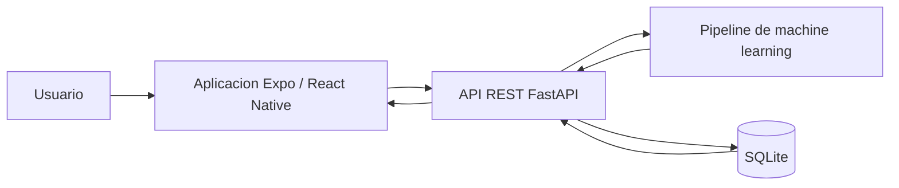

# Diabetes Risk App

Solucion academica integrada para estimar de manera referencial el riesgo de diabetes a partir de ocho variables del dataset Pima Indians Diabetes.

> Esta aplicacion no diagnostica diabetes, no reemplaza una evaluacion profesional y no debe tratarse como dispositivo medico.

## Repositorios

- `diabetes-app`: frontend movil con Expo, React Native y TypeScript.
- `FastApi`: backend con FastAPI, SQLite y scikit-learn.
- `docs`: evidencias y documentos para exposicion final.

## Arquitectura



## Variables

`Pregnancies`, `Glucose`, `BloodPressure`, `SkinThickness`, `Insulin`, `BMI`, `DiabetesPedigreeFunction`, `Age`.

El orden se guarda en `FastApi/model/model_metadata.json` y se usa tambien en inferencia.

## Modelo

El entrenamiento compara regresion logistica, SVM, Random Forest, KNN y arbol de decision. El criterio prioriza `recall` de la clase positiva por ser una herramienta preventiva y desempata con F1, precision y ROC-AUC.

Modelo seleccionado: `Arbol de Decision` v`1.0.0`.

| Accuracy | Precision | Recall | F1 | ROC-AUC |
| ---: | ---: | ---: | ---: | ---: |
| 0.7597 | 0.6393 | 0.7222 | 0.6783 | 0.7622 |

Matriz de confusion:

```text
[[78, 22],
 [15, 39]]
```

## Ejecutar Backend

Linux:

```bash
cd FastApi
python -m venv .venv
source .venv/bin/activate
pip install -r requirements.txt
python model/train.py
uvicorn api.main:app --reload --host 0.0.0.0 --port 8000
```

Windows:

```powershell
cd FastApi
python -m venv .venv
.\.venv\Scripts\activate
pip install -r requirements.txt
python model\train.py
uvicorn api.main:app --reload --host 0.0.0.0 --port 8000
```

Docker:

```bash
cd FastApi
docker build -t diabetes-api .
docker run --rm -p 8000:8000 -v "$(pwd)/data:/app/data" diabetes-api
```

## Ejecutar Frontend

```bash
cd diabetes-app
npm install
cp .env.example .env
```

Editar `.env`:

```env
EXPO_PUBLIC_API_BASE_URL=http://IP_DE_TU_PC:8000
```

Expo Go en dispositivo fisico no debe usar `localhost`; debe usar la IP LAN de la computadora. En emulador Android puede usarse `http://10.0.2.2:8000`.

```bash
npx expo start --host lan
```

## Pruebas

Backend:

```bash
cd FastApi
pytest -q
```

Frontend:

```bash
cd diabetes-app
npm run lint
npm run typecheck
npm test -- --runInBand
```

## Contrato Principal

`POST /predict` devuelve:

- `id`
- `prediction`
- `risk`
- `probability`
- `risk_percentage`
- `threshold`
- `message`
- `recommendation`
- `model_name`
- `model_version`
- `created_at`

`probability` sale de `predict_proba()` y `risk_percentage` es una estimacion del modelo entre 0 y 100.

## Privacidad

No se solicitan nombres, DNI, correo ni identificadores personales. SQLite guarda solo variables de entrada y resultado con fines academicos. La app incluye opcion para borrar historial.

## Evidencias

Ver `docs/guion-demo.md` para capturas pendientes y orden de presentacion.
