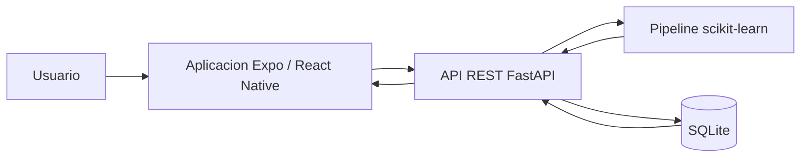

# Arquitectura

Proyecto academico para estimar de forma referencial el riesgo de diabetes a partir de ocho variables del dataset Pima Indians Diabetes.

> No es un diagnostico medico ni reemplaza una evaluacion profesional.

## Componentes

- `diabetes-app`: app movil Expo, React Native y TypeScript.
- `FastApi`: API REST, SQLite y pipeline de machine learning.
- `FastApi/model/model.pkl`: pipeline completo con imputacion, escalamiento cuando corresponde y clasificador ganador.
- `FastApi/model/model_metadata.json`: metadata confiable para version, orden de variables, umbral y metricas.
- `FastApi/data/predictions.db`: base generada localmente para historial academico.

## Flujo de prediccion

1. El usuario completa las ocho variables en la app.
2. El frontend valida campos vacios, rangos, `NaN` e infinitos.
3. La app envia `POST /predict`.
4. FastAPI valida con Pydantic.
5. El servicio de modelo arma un `DataFrame` con el orden exacto de entrenamiento.
6. El pipeline ejecuta imputacion/preprocesamiento y `predict_proba`.
7. La API calcula `prediction`, `risk`, `probability` y `risk_percentage`.
8. SQLite guarda entrada minima, resultado, metadata y timestamp UTC.
9. La app muestra resultado y permite consultar o borrar historial.
