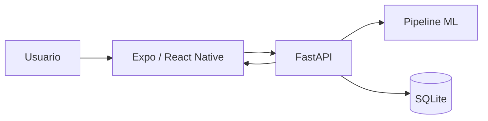

# Guion de Demo

Duracion sugerida: 5 a 7 minutos.

## 1. Problema

Explicar que la app busca orientar de forma preventiva y academica sobre riesgo de diabetes usando ocho indicadores. Aclarar que no diagnostica.

## 2. Arquitectura

Mostrar el diagrama:



## 3. Formulario

Abrir Expo Go y mostrar el flujo por pasos con las ocho variables.

Captura pendiente: pantalla de formulario.

## 4. Validaciones

Ingresar un valor fuera de rango, por ejemplo edad `130`, y mostrar el mensaje local.

Captura pendiente: validacion local.

## 5. Prediccion

Enviar un payload valido y mostrar que la app pasa a la pestaña Resultado.

Captura pendiente: pantalla de carga o boton cargando.

## 6. Explicacion del resultado

Mostrar riesgo, porcentaje estimado por modelo, recomendacion, modelo y umbral. Decir que el porcentaje proviene de `predict_proba()`, no de una clase inventada.

Captura pendiente: pantalla de resultado.

## 7. Historial

Mostrar registros guardados en SQLite y boton para borrar historial con confirmacion.

Captura pendiente: historial y confirmacion de borrado.

## 8. Metricas

Abrir `/model/metrics` o Swagger y mostrar la tabla generada por entrenamiento.

Captura pendiente: Swagger o endpoint de metricas.

## 9. Pruebas

Mostrar terminal con:

```bash
pytest -q
npm run lint
npm run typecheck
npm test -- --runInBand
```

## 10. Limitaciones y cierre

Mencionar dataset academico, ausencia de diagnostico, falta de variables clinicas completas y uso de SQLite solo para historial academico sin datos personales.
